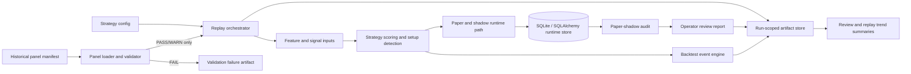
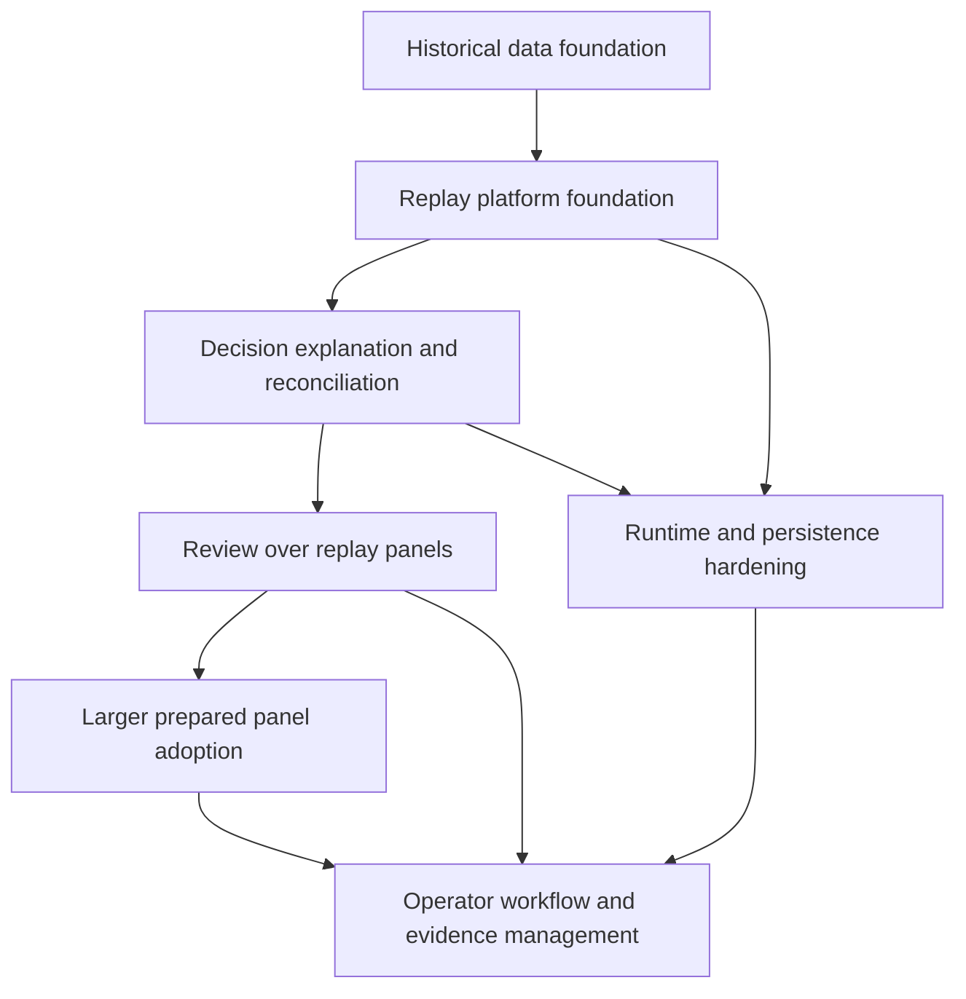

# Swingmachine Solution Design and Delivery Roadmap

Generated: 2026-04-30

This is the control document for the current Swingmachine design/build phase.
It replaces next-task planning with a delivery program: workstreams, grouped
implementation batches, dependencies, acceptance criteria, and explicit
non-goals.

The purpose is not to pick the next convenient command. The purpose is to make
the system progressively able to answer the product and engineering questions
that matter before performance baselining or live execution are considered.

## 1. Current Position

### Product Phase

Swingmachine is still in design/build. It is a local research and review system
for a deterministic daily-bar swing trading workflow. It can already exercise
paper and shadow execution paths, persist runtime evidence, generate review
artifacts, validate prepared historical panels, and run a tiny manifest-backed
replay proof.

This phase is about proving the machinery:

1. Prepared data can be trusted or rejected with structured reasons.
2. Replay can run deterministically from a manifest.
3. Decisions can be traced from input data to setup, order intent, shadow
   outcome, paper state, audit result, and review status.
4. Review outputs can expose internal consistency problems.
5. Repeated runs can create evidence about system stability.

This phase is not about proving that the strategy is profitable.

### Evidence From The Current Build

| Area | Current Evidence |
| --- | --- |
| Strategy and configuration | `swing_trading_bot_design_spec_v2.md`, `swing_trading_bot_config_template_v2.yaml`, `src/swingmachine/config.py` |
| Domain contracts | `src/swingmachine/contracts.py`, `src/swingmachine/enums.py` |
| Runtime orchestration | `src/swingmachine/runtime.py` |
| Persistence | `src/swingmachine/storage.py`, `src/swingmachine/run_history.py`, `migrations/versions/*.py` |
| Paper/shadow/audit | `src/swingmachine/broker.py`, `src/swingmachine/shadow.py`, `src/swingmachine/shadow_reviews.py`, `src/swingmachine/paper_shadow_audit.py` |
| Review artifacts | `src/swingmachine/reporting.py`, `src/swingmachine/review_rendering.py` |
| Historical panel contracts | `src/swingmachine/data_contracts.py`, `tests/fixtures/historical_panel/manifest.yaml` |
| Replay proof | `src/swingmachine/replay.py`, `tests/test_replay_workflow.py` |
| Quality checks | `.github/workflows/ci.yml`, `pyproject.toml`, `mypy_core.ini` |

## 2. North-Star Question Stack

The build should move through these questions in order. Later questions should
not pull implementation work forward before earlier ones are credible.

1. Can the system define the data it needs?
2. Can it reject bad, incomplete, or contradictory data?
3. Can it replay a validated panel deterministically?
4. Can it explain every material decision and non-decision?
5. Can backtest, shadow, paper, audit, and review outputs reconcile?
6. Can repeated review runs distinguish recurring system defects from isolated
   fixture problems?
7. Only after those are stable: is the strategy worth baselining, tuning, or
   comparing against alternatives?

## 3. Non-Goals For The Current Program

Do not spend implementation effort on these yet:

- Live broker adapters.
- Broker credentials, permissions, order routing, or account operations.
- Production scheduling, queues, services, deployment, or alerting.
- Profitability claims, CAGR, Sharpe, win-rate baselines, or optimization.
- Vendor-specific ingestion paths.
- Dashboards before artifact semantics are stable.
- Broad pandas-heavy refactors without a clear contract or safety payoff.

## 4. Target Architecture

### Component Responsibilities

| Component | Responsibility | Key Files |
| --- | --- | --- |
| Panel contracts | Describe prepared data files and validation results | `src/swingmachine/contracts.py`, `src/swingmachine/data_contracts.py` |
| Replay orchestration | Run deterministic machinery checks from a manifest | `src/swingmachine/replay.py`, future CLI in `src/swingmachine/runtime.py` |
| Strategy engine | Score candidates and detect setups | `src/swingmachine/signals.py`, `src/swingmachine/backtest.py`, `src/swingmachine/research.py` |
| Paper/shadow runtime | Simulate execution paths without live orders | `src/swingmachine/broker.py`, `src/swingmachine/shadow.py`, `src/swingmachine/runtime.py` |
| Audit and review | Compare outcomes, persist snapshots, render operator evidence | `src/swingmachine/paper_shadow_audit.py`, `src/swingmachine/shadow_reviews.py`, `src/swingmachine/reporting.py`, `src/swingmachine/review_rendering.py` |
| Run history | Record run and event identity | `src/swingmachine/run_history.py`, `src/swingmachine/storage.py`, `migrations/versions/*.py` |

## 5. Workstreams

The program has seven workstreams. Implementation batches should usually touch
multiple workstreams together so the delivered capability is coherent.

### A. Historical Data Foundation

Purpose: make prepared data explicit, versioned, validated, and replayable.

Current state:

- `HistoricalPanelManifest`, `HistoricalPanelFiles`,
  `HistoricalPanelValidationResult`, and related issue/summary contracts exist
  in `src/swingmachine/contracts.py`.
- `validate_historical_panel_manifest` and `load_historical_panel_data` exist in
  `src/swingmachine/data_contracts.py`.
- A tiny manifest fixture exists under `tests/fixtures/historical_panel/`.

Remaining design work:

- Decide when CSV stops being sufficient and whether Parquet becomes the
  standard for larger panels.
- Add optional checksum validation once larger external panels are used.
- Define where external prepared datasets live. They should not be committed
  into the package.

### B. Replay And Artifact Platform

Purpose: make replay a first-class, deterministic operation with inspectable
outputs.

Current state:

- `run_tiny_manifest_replay_proof` exists in `src/swingmachine/replay.py`.
- The proof refuses invalid panels and compares material outputs across repeated
  tiny runs in `tests/test_replay_workflow.py`.

Remaining design work:

- Promote the proof into a general replay runner.
- Add a run-scoped artifact directory with stable file names and schemas.
- Persist replay metadata through the existing run-history model.
- Keep replay success based on structural consistency, not returns.

### C. Decision Traceability

Purpose: make accepted and rejected decisions explainable.

Current state:

- Review reports and audit snapshots explain some runtime outcomes.
- The tiny replay proof returns stage summaries and material decisions.

Remaining design work:

- Add a `DecisionTrace` style contract for per-symbol/per-session outcomes.
- Preserve reason categories for rejected, skipped, submitted, expired, filled,
  and unmatched decisions.
- Make trace artifacts consumable by review reports.

### D. Review Intelligence

Purpose: make local review artifacts more useful without turning them into a
premature dashboard.

Current state:

- `run-review-report` produces JSON/YAML/HTML outputs.
- Review summaries include threshold-driven `PASS`, `WARN`, or `FAIL` status.
- Trend summaries exist for repeated review runs.

Remaining design work:

- Teach review reports to consume replay artifacts directly.
- Add count reconciliation across replay stages.
- Make threshold defaults clearly about machinery consistency, not strategy
  profitability.

### E. Runtime And Persistence Hardening

Purpose: keep state, identifiers, and artifact generation reliable as replay
coverage grows.

Current state:

- SQLAlchemy models and migrations exist for runtime runs/events, shadow
  snapshots, audit snapshots, and review runs.
- Local SQLite is sufficient for the current phase.

Remaining design work:

- Decide whether replay runs need their own table or can use `runtime_runs`
  with stronger metadata conventions.
- Add stable run IDs to artifact filenames and review links.
- Ensure interrupted runs leave diagnostic artifacts.

### F. Type And Contract Boundary Hardening

Purpose: move safety checks toward the modules that define system behavior.

Current state:

- `mypy_core.ini` passes for the current typed runtime core.
- Full strict package mypy remains non-blocking because pandas-heavy modules
  still have known errors.

Remaining design work:

- Expand typed coverage where it reduces ambiguity at contracts and runtime
  boundaries.
- Avoid turning broad typing cleanup into an unrelated refactor.

### G. Operator Workflow And Evidence Management

Purpose: make local operation repeatable, recoverable, and auditable.

Current state:

- `README.md` and `docs/OPERATING_RUNBOOK.md` document current CLI workflows.
- `docs/archive/build-phase/SESSION_CONTINUATION.md` records working state and validation caveats.

Remaining design work:

- Add a standard replay review workflow once the general runner exists.
- Document artifact retention and naming conventions.
- Keep handover material current after meaningful program changes.

## 6. Integrated Delivery Batches

These batches are grouped upgrades. They are intentionally larger than a single
function or command, but each has a clear boundary and acceptance criteria.

### Batch 1: Replay Platform Foundation

Status: partly complete. The validator and tiny proof exist; the general runner
and artifacts are pending.

Problem being solved:

- The system cannot yet use a meaningful prepared panel as repeatable evidence.

Design:

- Start every replay from a historical panel manifest.
- Treat validation as a hard precondition. `FAIL` means no replay.
- Add a general replay service and CLI command that produce run-scoped
  artifacts.
- Store material decisions, stage summaries, and validation summaries.
- Persist replay metadata to the runtime history layer.

Likely files:

- `src/swingmachine/replay.py`
- `src/swingmachine/runtime.py`
- `src/swingmachine/contracts.py`
- `src/swingmachine/data_contracts.py`
- `src/swingmachine/run_history.py`
- `tests/test_replay_workflow.py`
- `tests/test_runtime.py`
- `README.md`
- `docs/OPERATING_RUNBOOK.md`

Expected artifacts:

- `validation_summary.json`
- `replay_summary.json`
- `stage_counts.json`
- `material_decisions.json`
- `failure_summary.json` when replay cannot proceed

Acceptance criteria:

- Valid tiny manifest runs through the general path.
- Invalid manifest produces a structured failure artifact and does not replay.
- Two runs over the same manifest/config have identical material decisions after
  volatile timestamps are excluded.
- Tests assert consistency and determinism, not profitability.

Non-goals:

- Large-panel performance metrics.
- External ingestion.
- Live execution.
- Dashboard work.

### Batch 2: Decision Explanation And Reconciliation

Status: designed here; not implemented as a complete package.

Problem being solved:

- A run can produce outputs, but another reviewer still needs clearer evidence
  for why each material decision happened.

Design:

- Introduce a structured decision trace contract.
- Capture per-stage reason categories for accepted and rejected candidates.
- Reconcile counts between candidate scoring, setup detection, order intent,
  backtest events, shadow outcomes, paper state, audit rows, and review checks.
- Add one accepted-case fixture and one rejected/mismatch fixture.

Likely files:

- `src/swingmachine/contracts.py`
- `src/swingmachine/signals.py`
- `src/swingmachine/backtest.py`
- `src/swingmachine/replay.py`
- `src/swingmachine/reporting.py`
- `src/swingmachine/paper_shadow_audit.py`
- `tests/test_replay_workflow.py`
- `tests/test_reporting.py`

Expected artifacts:

- `decision_traces.json`
- `reconciliation_summary.json`
- `rejection_reasons.json`

Acceptance criteria:

- At least one accepted setup can be traced from panel row to review outcome.
- At least one rejected or skipped case has a readable reason category.
- Reconciliation failures become `WARN` or `FAIL` review evidence.
- Artifacts remain JSON-first.

Non-goals:

- A polished visual explorer.
- Strategy tuning from reason counts.

### Batch 3: Review Over Replay Panels

Status: pending Batch 1 and Batch 2.

Problem being solved:

- Review and replay are currently adjacent concepts. The next maturity step is
  to make review consume replay output as first-class evidence.

Design:

- Extend review report inputs to include replay artifact directories or replay
  run IDs.
- Add checks for validation status, deterministic decision identity, stage count
  reconciliation, and audit alignment.
- Extend trend summaries so repeated replay-review runs can be compared.

Likely files:

- `src/swingmachine/reporting.py`
- `src/swingmachine/review_rendering.py`
- `src/swingmachine/runtime.py`
- `src/swingmachine/run_history.py`
- `tests/test_reporting.py`
- `tests/test_runtime.py`

Expected artifacts:

- Review JSON/HTML with replay sections.
- Trend summary that includes replay status counts and recurring issue codes.

Acceptance criteria:

- Review reports clearly distinguish local machinery status from strategy
  performance.
- Repeated replay-review runs can show whether the same validation/reconciliation
  problems recur.
- HTML remains a rendered artifact, not the source of truth.

Non-goals:

- External observability systems.
- Alert transport.

### Batch 4: Larger Prepared Panel Adoption

Status: pending Batch 1 and enough Batch 2 traceability to debug failures.

Problem being solved:

- Tiny fixtures prove control flow, but larger prepared panels are needed to find
  data and decision-path defects.

Design:

- Keep large datasets outside the repo.
- Define an external data directory convention and manifest examples.
- Add optional row counts, symbol/session expectations, and checksums.
- Add Parquet support only if CSV becomes too slow or too large for normal
  local iteration.
- Run a modest prepared panel first, then expand.

Likely files:

- `src/swingmachine/data_contracts.py`
- `src/swingmachine/replay.py`
- `examples/`
- `docs/OPERATING_RUNBOOK.md`
- `docs/HISTORICAL_PANEL_REQUIREMENTS.md`

Acceptance criteria:

- A larger prepared panel validates without code changes to the manifest schema.
- Failures identify symbol/session/file/stage clearly enough to fix the input or
  code path.
- The run produces artifacts small enough to inspect locally or summaries that
  point to detailed files.

Non-goals:

- Vendor ingestion code.
- Performance baselining.
- Parameter optimization.

### Batch 5: Contract, Typing, And Operational Hardening

Status: ongoing after the replay path is stable enough to justify hardening.

Problem being solved:

- As more paths connect, weak contracts and loosely typed boundaries become
  harder to debug.

Design:

- Expand `mypy_core.ini` into modules that now sit on critical replay/review
  boundaries.
- Add artifact schema tests for replay and review JSON outputs.
- Improve interrupted-run recovery documentation.
- Keep broad research-module cleanup separate unless it directly affects replay
  correctness.

Likely files:

- `mypy_core.ini`
- `src/swingmachine/replay.py`
- `src/swingmachine/reporting.py`
- `src/swingmachine/review_rendering.py`
- `src/swingmachine/paper_shadow_audit.py`
- `tests/test_replay_workflow.py`
- `tests/test_reporting.py`
- `docs/OPERATING_RUNBOOK.md`

Acceptance criteria:

- More critical modules are included in the typed-core check.
- Replay and review artifact schemas are tested.
- Recovery guidance explains what to inspect after validation, replay, audit, or
  review failure.

Non-goals:

- Making full strict package mypy blocking before pandas-heavy modules are
  intentionally cleaned up.

## 7. Dependency Map

Key dependency decisions:

- Do not adopt larger panels before invalid data and deterministic replay
  failures are easy to diagnose.
- Do not tune thresholds before review can explain whether failures are
  machinery defects or expected differences.
- Do not add live execution until replay, audit, review, and operator workflows
  are demonstrably stable.

## 8. Design Decisions To Make Before Coding More Runtime Surface

| Decision | Why It Matters | Recommended Default |
| --- | --- | --- |
| Replay artifact schema | Another reviewer needs stable evidence across runs | JSON-first, run-scoped directory, stable filenames |
| Replay run persistence | Run identity should connect artifacts to DB evidence | Reuse `runtime_runs` initially with explicit replay metadata |
| Decision trace granularity | Too little detail blocks debugging; too much creates noise | Per symbol/session/stage with reason categories and counts |
| Larger panel storage | Large datasets should not pollute the repo | External prepared-data path with manifest examples |
| CSV versus Parquet | Large local runs may become slow | CSV for fixtures; add Parquet when there is real friction |
| Review status language | Avoid confusing machinery status with profitability | `PASS`/`WARN`/`FAIL` only for consistency and evidence quality |

## 9. Implementation Discipline

Every implementation batch should include:

- A short design note in this document or an adjacent doc before code changes.
- Explicit non-goals.
- Contracts or schemas first when data crosses module boundaries.
- Implementation and tests in the same coherent change set.
- Docs and `docs/archive/build-phase/SESSION_CONTINUATION.md` updates when behavior or workflow changes.
- Honest validation: commands run, observed result, and known gaps.

Avoid:

- One more CLI command without artifact and review semantics.
- Tests that only prove a known-broken baseline is broken.
- Broad cleanup that is not attached to a program risk.
- Letting live trading concerns shape the design/build phase.

## 10. Near-Term Roadmap

### Immediate Focus: Finish Batch 1 And Prepare Batch 2 Hooks

Build as one coherent upgrade set:

1. General replay runner from manifest.
2. Run-scoped artifact directory.
3. Runtime CLI command for replay.
4. Structured failure artifact for validation and replay failures.
5. Basic material-decision artifact that Batch 2 can extend.
6. Tests for valid, invalid, deterministic, and failure-preserving paths.
7. README and runbook updates.

The implementation should preserve the current tiny proof as a focused test
helper or migrate it behind the general runner if that removes duplication.

### Next Focus: Decision Explanation And Reconciliation

Build after the general runner exists:

1. Decision trace contract.
2. Reason categories for accepted, rejected, skipped, submitted, filled,
   expired, and unmatched decisions.
3. Stage count reconciliation.
4. At least one accepted trace fixture and one intentional mismatch fixture.
5. Review-report consumption of reconciliation status where useful.

### Following Focus: Review Over Replay Panels

Build once replay artifacts and traces are stable:

1. Review report sections for replay runs.
2. Trend summaries for repeated replay-review runs.
3. Operator guidance for interpreting recurring validation or reconciliation
   issues.

### Later Focus: Larger Prepared Panels

Use external prepared datasets only after replay and explanation are strong
enough to make failures actionable.

1. External panel path convention.
2. Optional checksums and row-count expectations.
3. Modest panel trial.
4. Artifact-size controls and summaries.

## 11. Highest-ROI Changes

1. General manifest replay runner with artifacts: unlocks real evidence without
   jumping to performance baselining.
2. Decision trace contract: makes review and debugging materially easier.
3. Replay-aware review report: joins the existing review machinery to the new
   historical evidence path.

## 12. Biggest Risk Reductions

1. Hard validation precondition before replay: prevents bad data from becoming
   misleading evidence.
2. Deterministic material-decision comparison: catches hidden wall-clock,
   ordering, and identity problems.
3. Count reconciliation across stages: exposes mismatches between backtest,
   shadow, paper, audit, and review.

## 13. Best Experiments To Validate Next

1. Run the general replay path twice over the tiny fixture and compare material
   artifacts after volatile metadata is removed.
2. Introduce one deliberate panel defect and confirm the system refuses replay
   with a useful failure artifact.
3. Introduce one deliberate stage mismatch and confirm the review layer surfaces
   it as machinery evidence rather than hiding it in raw events.

## 14. Definition Of Baseline-Worthy

Strategy performance baselining should stay deferred until all of these are
true:

- Historical panels are manifest-backed and validated.
- Replay is deterministic for the same manifest and config.
- Decision artifacts explain accepted and rejected outcomes.
- Backtest, shadow, paper, audit, and review counts reconcile or explain
  differences.
- Repeated review trends show the machinery is stable enough that performance
  metrics would not mostly measure plumbing defects.
- The team has explicitly chosen the metrics and accepted their limitations.

Until then, progress should be judged by coherence, determinism, traceability,
and reviewability.
