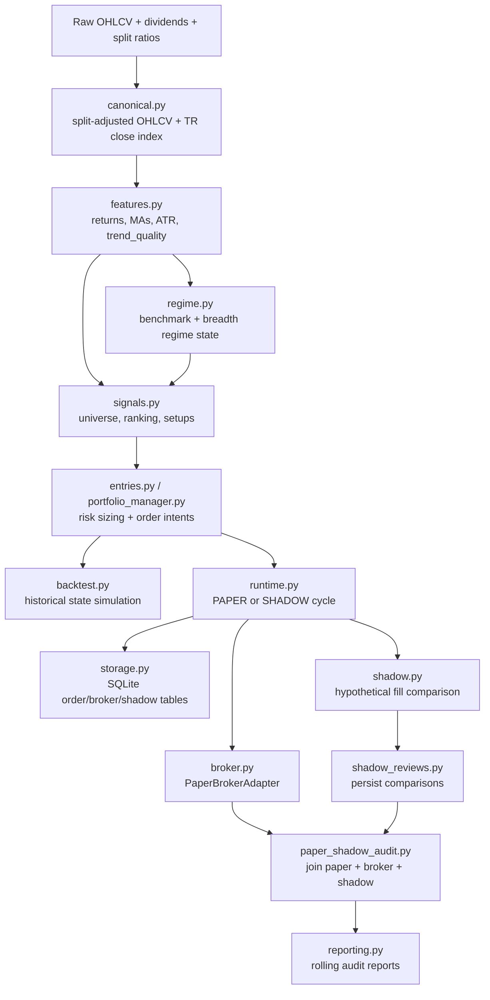

# swingmachine — Build Handover and Critical Assessment

```yaml
inspection_date_time: "2026-04-30 10:35:31 BST +0100"
repo_workspace_names:
  - swingmachine
primary_workspace_path: "/home/alexballard92/swingmachine"
branch: "main (from parent git root /home/alexballard92)"
commit_hash: "Unknown: parent git repository has no valid HEAD; swingmachine/ is untracked"
directories_inspected:
  - "."
  - ".github/workflows"
  - "docs"
  - "examples"
  - "migrations"
  - "src/swingmachine"
  - "tests"
  - "src/swingmachine.egg-info"
documents_inspected:
  - "swing_trading_bot_design_spec_v2.md"
  - "swing_trading_bot_config_template_v2.yaml"
  - "swing_trading_bot_codex_feedback_resolution_v2.md"
  - "swing_trading_bot_design_spec.md"
  - "swing_trading_bot_config_template.yaml"
commands_run:
  - "rg --files -g '!*.pyc' -g '!__pycache__' -g '!.pytest_cache' -g '!.venv'"
  - "find . -maxdepth 3 -type f ... | xargs -r wc -l"
  - "rg -n \"^(class|def) |^@app\\.command|^app =\" src/swingmachine tests -g '*.py'"
  - "git -C /home/alexballard92 rev-parse --show-toplevel && git -C /home/alexballard92 branch --show-current && git -C /home/alexballard92 rev-parse HEAD && git -C /home/alexballard92 status --short -- swingmachine"
  - "./.venv/bin/python -m compileall src tests"
  - "./.venv/bin/ruff check ."
  - "./.venv/bin/mypy --config-file mypy_core.ini --show-error-codes"
  - "./.venv/bin/mypy --show-error-codes"
  - "./.venv/bin/pytest -q tests/test_data_contracts.py tests/test_migrations.py"
  - "./.venv/bin/pytest -q"
  - "./.venv/bin/ruff format src/swingmachine/enums.py src/swingmachine/runtime.py tests/test_runtime.py"
  - "./.venv/bin/python -m compileall src/swingmachine/runtime.py src/swingmachine/enums.py tests/test_runtime.py"
  - "./.venv/bin/pytest -q tests/test_runtime.py"
  - "rg -n \"Trading212|trading212|TRADING212\" . -g '!*.pyc' -g '!__pycache__' -g '!.pytest_cache' -g '!.venv'"
  - "MYPYPATH=src ./.venv/bin/mypy --strict --follow-imports=normal --show-error-codes src/swingmachine/modeling.py src/swingmachine/enums.py src/swingmachine/config.py src/swingmachine/contracts.py src/swingmachine/storage.py src/swingmachine/run_history.py src/swingmachine/runtime.py"
  - "./.venv/bin/python -m compileall src/swingmachine/storage.py src/swingmachine/shadow_reviews.py tests/test_shadow_reviews.py tests/test_replay_workflow.py migrations/versions/0003_shadow_comparison_snapshots.py"
  - "./.venv/bin/pytest -q tests/test_shadow_reviews.py tests/test_migrations.py"
  - "./.venv/bin/pytest -q tests/test_shadow_reviews.py tests/test_migrations.py tests/test_replay_workflow.py"
  - "./.venv/bin/python -m compileall src/swingmachine/contracts.py src/swingmachine/storage.py src/swingmachine/analytics.py src/swingmachine/shadow_reviews.py src/swingmachine/runtime.py tests/test_shadow_reviews.py"
  - "./.venv/bin/pytest -q tests/test_shadow_reviews.py"
  - "./.venv/bin/python -m compileall src/swingmachine/contracts.py src/swingmachine/analytics.py src/swingmachine/storage.py src/swingmachine/paper_shadow_audit.py src/swingmachine/runtime.py tests/test_paper_shadow_audit.py migrations/versions/0004_paper_shadow_audit_snapshots.py"
  - "./.venv/bin/pytest -q tests/test_paper_shadow_audit.py tests/test_migrations.py"
  - "./.venv/bin/ruff format src/swingmachine/contracts.py src/swingmachine/reporting.py src/swingmachine/runtime.py src/swingmachine/enums.py src/swingmachine/__init__.py tests/test_reporting.py"
  - "./.venv/bin/python -m compileall src/swingmachine/contracts.py src/swingmachine/reporting.py src/swingmachine/runtime.py src/swingmachine/enums.py tests/test_reporting.py"
  - "./.venv/bin/pytest -q tests/test_reporting.py"
  - "./.venv/bin/ruff check ."
  - "./.venv/bin/mypy --config-file mypy_core.ini --show-error-codes"
  - "./.venv/bin/python -m json.tool docs/archive/build-phase/BUILD_HANDOVER_SUMMARY.json"
  - "./.venv/bin/pytest -q tests/test_runtime.py tests/test_reporting.py"
  - "./.venv/bin/ruff format src/swingmachine/review_rendering.py src/swingmachine/runtime.py src/swingmachine/__init__.py tests/test_reporting.py"
  - "./.venv/bin/python -m compileall src/swingmachine/review_rendering.py src/swingmachine/runtime.py tests/test_reporting.py"
  - "./.venv/bin/pytest -q tests/test_reporting.py"
  - "./.venv/bin/pytest -q tests/test_reporting.py::test_run_review_report_cli_writes_operator_review_html"
  - "./.venv/bin/ruff format src/swingmachine/enums.py src/swingmachine/contracts.py src/swingmachine/reporting.py src/swingmachine/runtime.py src/swingmachine/review_rendering.py tests/test_reporting.py"
  - "./.venv/bin/python -m compileall src/swingmachine/enums.py src/swingmachine/contracts.py src/swingmachine/reporting.py src/swingmachine/runtime.py src/swingmachine/review_rendering.py tests/test_reporting.py"
  - "./.venv/bin/pytest -q tests/test_reporting.py"
  - "./.venv/bin/ruff check ."
  - "./.venv/bin/mypy --config-file mypy_core.ini --show-error-codes"
  - "./.venv/bin/ruff format tests/test_reporting.py tests/fixtures/review_scenarios.py"
  - "./.venv/bin/python -m compileall tests/test_reporting.py tests/fixtures/review_scenarios.py"
  - "./.venv/bin/pytest -q tests/test_reporting.py::test_multi_session_review_scenarios_exercise_pass_warn_fail"
  - "./.venv/bin/pytest -q tests/test_reporting.py"
  - "./.venv/bin/ruff format src/swingmachine/reporting.py src/swingmachine/runtime.py tests/test_reporting.py"
  - "./.venv/bin/python -m compileall src/swingmachine/reporting.py src/swingmachine/runtime.py tests/test_reporting.py"
  - "./.venv/bin/python -m json.tool docs/archive/build-phase/BUILD_HANDOVER_SUMMARY.json"
  - "./.venv/bin/ruff check ."
  - "./.venv/bin/mypy --config-file mypy_core.ini --show-error-codes"
  - "./.venv/bin/pytest -q tests/test_reporting.py::test_run_review_report_cli_writes_operator_review_file"
  - "./.venv/bin/pytest -q tests/test_reporting.py::test_multi_session_review_scenarios_exercise_pass_warn_fail"
  - "./.venv/bin/pytest -q tests/test_reporting.py"
  - "./.venv/bin/ruff format tests/test_reporting.py"
  - "./.venv/bin/python -m compileall tests/test_reporting.py"
  - "./.venv/bin/pytest -q tests/test_reporting.py::test_multi_session_review_scenarios_exercise_pass_warn_fail"
  - "./.venv/bin/pytest -q tests/test_reporting.py"
  - "./.venv/bin/ruff check --fix tests/test_reporting.py && ./.venv/bin/ruff format tests/test_reporting.py"
  - "./.venv/bin/ruff check ."
  - "./.venv/bin/python -m compileall src/swingmachine/reporting.py src/swingmachine/runtime.py tests/test_runtime.py"
  - "./.venv/bin/pytest -q tests/test_runtime.py::test_runtime_cli_summarizes_review_run_trends"
  - "./.venv/bin/mypy --config-file mypy_core.ini --show-error-codes"
  - "./.venv/bin/pytest -q tests/test_runtime.py"
  - "sed -n '1,260p' docs/SOLUTION_DESIGN_AND_DELIVERY_ROADMAP.md"
  - "sed -n '1,260p' docs/BUILD_ROADMAP.md"
  - "sed -n '1,260p' docs/HISTORICAL_PANEL_REQUIREMENTS.md"
  - "rg -n \"BUILD_ROADMAP|historical panel|Trading212|broker-vendor\" README.md docs/BUILD_PLAN.md docs/BUILD_ROADMAP.md docs/archive/build-phase/SESSION_CONTINUATION.md"
  - "git -C /home/alexballard92 status --short -- swingmachine"
  - "./.venv/bin/ruff format src/swingmachine/contracts.py src/swingmachine/data_contracts.py tests/test_data_contracts.py"
  - "./.venv/bin/python -m compileall src/swingmachine/contracts.py src/swingmachine/data_contracts.py tests/test_data_contracts.py"
  - "./.venv/bin/pytest -q tests/test_data_contracts.py"
  - "./.venv/bin/ruff check src/swingmachine/contracts.py src/swingmachine/data_contracts.py tests/test_data_contracts.py"
  - "./.venv/bin/ruff check ."
  - "./.venv/bin/mypy --config-file mypy_core.ini --show-error-codes"
  - "./.venv/bin/pytest -q tests/test_data_contracts.py tests/test_replay_workflow.py"
  - "./.venv/bin/python -m json.tool docs/archive/build-phase/BUILD_HANDOVER_SUMMARY.json"
  - "./.venv/bin/ruff format src/swingmachine/contracts.py src/swingmachine/data_contracts.py src/swingmachine/replay.py tests/test_data_contracts.py tests/test_replay_workflow.py"
  - "./.venv/bin/python -m compileall src/swingmachine/contracts.py src/swingmachine/data_contracts.py src/swingmachine/replay.py tests/test_data_contracts.py tests/test_replay_workflow.py"
  - "./.venv/bin/pytest -q tests/test_data_contracts.py tests/test_replay_workflow.py"
  - "./.venv/bin/ruff check ."
  - "./.venv/bin/mypy --config-file mypy_core.ini --show-error-codes"
  - "./.venv/bin/python -m json.tool docs/archive/build-phase/BUILD_HANDOVER_SUMMARY.json"
confidence_level: "medium"
confidence_reason: "High confidence about current code behavior, configs, tests, README/CI/runtime artifacts, migration baseline, and missing repo artifacts. Lower confidence about production readiness, business intent, git evolution, and live operations because there is no valid commit history for this workspace, no deployment/scheduler artifacts, and no real broker/data integration in this repo."
```

## 1. Executive summary

**Fact:** `swingmachine` is a Python 3.11 package for a deterministic, long-only, daily-bar swing trading strategy described as "Regime-Filtered Trend Pullback Continuation Swing Bot" in `swing_trading_bot_design_spec_v2.md:1-9` and packaged as `swingmachine` in `pyproject.toml:5-9`.

**Fact:** The build currently implements a strategy/research/runtime core, not a production trading service. It includes canonical price transforms, feature computation, regime classification, candidate scoring, setup detection, entry sizing, exits, lifecycle/state-machine logic, backtesting, SQLite-backed order intent state, a paper broker adapter, shadow fill comparison with latest-state and immutable snapshot persistence, paper-vs-shadow audit with immutable audit-review snapshots, rolling audit reporting, a composed local operator review report with JSON/YAML/static HTML output, threshold-driven `PASS`/`WARN`/`FAIL` review checks, structured review-run metrics, repeated review trend summaries, JSON/HTML threshold-breach artifact checks, documented operator responses, multi-symbol/multi-session review scenario fixtures, run history, an append-only runtime event ledger with artifact and per-symbol/per-intent decision events, operator-facing snapshot review output, and Alembic migrations. Evidence: package module inventory in `src/swingmachine/*.py`; CLI commands in `src/swingmachine/runtime.py`; decision event writers in `src/swingmachine/runtime.py:439-608`; snapshot persistence in `storage.py:167-225`, `storage.py:542-819`, `shadow_reviews.py:29-132`, and `paper_shadow_audit.py:62-298`; composed review service and `operator_review_run_metrics` in `reporting.py:169-244`; review trend summarizer in `reporting.py:249-342`; CLI metric/trend persistence and summary commands in `runtime.py:1167-1186` and `runtime.py:1409-1422`; static renderer in `review_rendering.py`; review artifact assertions in `tests/test_reporting.py:306-324`; trend CLI assertions in `tests/test_runtime.py:368-475`; operator response guidance in `docs/OPERATING_RUNBOOK.md:170-182` and `README.md:124-126`; review fixtures in `tests/fixtures/review_scenarios.py`.

**Fact:** Functional tests pass: `./.venv/bin/pytest -q` returned `98 passed in 834.28s` after the audit-snapshot addition. Focused post-review-report checks pass: runtime `6 passed in 154.75s` after the review-trend CLI addition, review-trend CLI `1 passed in 99.66s`, reporting `9 passed in 274.95s` after JSON/HTML threshold-breach artifact checks, review scenario artifact checks `3 passed in 169.17s`, reporting `9 passed in 242.95s` after structured review run/event metrics, review-report CLI run/event metrics `1 passed in 124.69s`, reporting `9 passed in 186.21s` after review scenario fixtures, reporting `6 passed in 233.81s` after threshold status addition, reporting `5 passed in 297.00s` after static HTML addition, and runtime/reporting together `9 passed in 385.82s` before that addition. Earlier focused checks also pass: paper-shadow audit/migrations `4 passed in 289.20s`, and shadow review `4 passed in 212.13s`. `compileall` passed. **Fact:** lint is clean: `./.venv/bin/ruff check .` returned `All checks passed!`. **Fact:** the typed-core gate now checks seven files and passes: `./.venv/bin/mypy --config-file mypy_core.ini --show-error-codes` returned `Success: no issues found in 7 source files`. **Fact:** full strict typing is still not clean: `./.venv/bin/mypy --show-error-codes` returned 25 errors in 7 pandas-heavy/research modules.

Most important findings:

1. **Fact:** Product strategy clarity is strong. The v2.1 spec defines the thesis, price-source policy, regime rules, setup identity, state machine, and definition of done (`swing_trading_bot_design_spec_v2.md:23-49`, `:53-163`, `:198-268`, `:502-521`, `:710-757`, `:1063-1074`).
2. **Fact:** The code mirrors many core spec rules: split-adjusted chart series and total-return index in `canonical.py:77-99`; feature formulas in `features.py:103-204`; regime precedence in `regime.py:107-209`; candidate and setup logic in `signals.py:146-223` and `:260-453`.
3. **Fact:** Paper/shadow/audit capability is now present. `runtime.py` runs the one-command workflow and `run-review-report`; `paper_shadow_audit.py:62-298` joins paper intents, broker rows, and shadow comparisons and snapshots audit reviews; `reporting.py` builds rolling reports, review checks, the composed operator review report, structured run metrics through `operator_review_run_metrics`, and repeated review trend summaries through `summarize_operator_review_run_trends`; `runtime.py:1167-1186` persists those metrics to run history and the review-written event payload; `runtime.py:1409-1422` writes trend summaries from persisted review runs; `review_rendering.py` renders the report as static HTML; `tests/fixtures/review_scenarios.py` exercises `PASS`, `WARN`, and `FAIL` local review histories; `tests/test_reporting.py:306-324` verifies threshold breaches are visible in both JSON and HTML artifacts; `docs/OPERATING_RUNBOOK.md:170-182` documents operator responses.
4. **Fact:** Broker execution is paper-only. `execution.broker: PAPER` is set in `swing_trading_bot_config_template_v2.yaml:215-224`, and only `PaperBrokerAdapter` exists in `src/swingmachine/broker.py:56-180`.
5. **Fact:** There is no ingestion/orchestration layer for raw market data, corporate actions, earnings, reference master, or broker positions. Current engines accept already-shaped pandas frames or CLI input files; examples are `runtime.py:283-320`, `canonical.py:77-99`, `features.py:103-204`.
6. **Fact:** Persistence is SQLAlchemy ORM using `Base.metadata.create_all(engine)` for local runtime setup (`storage.py:243-244`) and now has Alembic revisions for the baseline, runtime event ledger, shadow comparison snapshots, and paper-shadow audit snapshots (`migrations/versions/0001_initial_schema.py`, `0002_runtime_events.py`, `0003_shadow_comparison_snapshots.py`, `0004_paper_shadow_audit_snapshots.py`) covered by `tests/test_migrations.py`.
7. **Fact:** README, examples, GitHub Actions CI, Alembic migrations, prepared-data validators, `.env.example`, local runbook, durable runtime run history, and append-only runtime artifact/decision events now exist. Deployment, scheduler, container, and service manager remain absent.
8. **Fact:** Operational monitoring is modeled as in-process alerts (`monitoring.py:29-171`), command run history, runtime event history, and report artifacts (`runtime.py:665-1221`), but there is no logging sink, metric backend, alert delivery, dashboard, or incident-response system.
9. **Inference:** The build is in late prototype / early operational-core stage: high deterministic-domain coverage, but not a deployable autonomous trading system.
10. **Unknown:** The real business constraints, target broker account permissions, accepted risk budget, and live-data vendors are not present in code or docs.

Scorecard:

| Area | Score | Evidence |
|---|---:|---|
| product clarity | 8 | Strong v2.1 spec and config: `swing_trading_bot_design_spec_v2.md:23-49`, `swing_trading_bot_config_template_v2.yaml:1-249`. |
| architecture | 7 | Modular package with clear strategy/runtime/storage boundaries, but no deployment/data-service boundary: `src/swingmachine/*.py`, `runtime.py:225-280`. |
| code health | 7 | Tests, Ruff, and seven-file typed-core mypy gate pass; strict full-package mypy still has known errors. |
| reliability | 7 | Restart-safe order intent/paper broker tests, run history, decision event ledger, replay workflow coverage, immutable comparison snapshots, and migrations exist, but no live broker, queueing, or deployment. |
| security/privacy | 4 | No secrets committed and local CLI only, but no auth/authz, credential handling, broker permission model, or compliance controls. |
| observability | 5 | Monitoring alert models and audit reports exist (`monitoring.py`, `reporting.py`), but no logging/metrics/alert delivery. |
| testing | 8 | 98 tests pass across strategy, runtime, storage, shadow, audit, research, data contracts, migrations, and replay; CI now enforces Ruff, typed-core mypy, and pytest, but no coverage threshold, property tests, or live adapter contract tests. |
| documentation | 8 | Specs are strong and README/examples now document the paper/shadow/audit path; deployment docs and production runbooks remain absent. |
| agent/prompt quality | 1 | No prompt stack, system instructions, skills, MCP config, or tool wrappers exist in this repo. |
| delivery readiness | 4 | CLI works and tests pass, but production prerequisites are absent. |

## 2. North star, purpose, and boundaries

**Fact:** The explicit strategy thesis is: "The bot should buy strong names resting in strong markets, not cheap laggards" (`swing_trading_bot_design_spec_v2.md:28-35`).

**Fact:** The documented strategy is "Long-only, daily-bar, regime-filtered trend / relative-strength pullback breakout" (`swing_trading_bot_design_spec_v2.md:7-10`). The package description is "Regime-filtered trend pullback continuation swing trading bot" (`pyproject.toml:6-9`).

User/customer problem:

- **Inference:** The user wants a deterministic swing-trading research and execution core that can graduate from backtest to paper/shadow to live trading while preventing duplicate orders, stale setup reuse, and regime-inappropriate entries.
- **Evidence:** The spec requires deterministic execution, backtest/live parity, broker reconciliation, spent setup persistence, no duplicate orders, and full auditability (`swing_trading_bot_design_spec_v2.md:927-940`, `:944-989`, `:1063-1074`).

Target users/stakeholders:

- **Inference:** Primary users are the strategy owner, a quant/dev operator, and later a trading operations reviewer.
- **Fact:** No user roles, customer personas, or business owner names are encoded in the repo.

Intended product/business outcome:

- **Inference:** Produce controlled, auditable swing-trading signals and order intents that can be evaluated in research, paper, shadow, and eventually small-capital live stages.
- **Evidence:** Deployment phases in `swing_trading_bot_design_spec_v2.md:992-1034`; runtime modes `PAPER` and `SHADOW` in `enums.py:122-124`.

Success metrics/KPIs:

- **Fact:** The repo implements analytics for trade count, win rate, gross/net P&L, costs, average returns, final equity, max drawdown (`analytics.py:59-86`), regime-segmented stats (`analytics.py:89-132`), shadow fill rates/costs/slippage (`analytics.py:203-345`), paper-shadow alignment rate (`analytics.py:411-444`), and rolling audit windows (`reporting.py:139-209`).
- **Unknown:** There are no explicit target KPI thresholds for acceptable profitability, drawdown, slippage, alignment rate, uptime, or incident rate.

Non-goals / boundaries:

- **Fact:** The spec explicitly rejects total-return-adjusted OHLC bars (`swing_trading_bot_design_spec_v2.md:137-139`), profit targets in the baseline (`:705-706`), pyramiding (`:45-49`), and multiple pending entries/open positions per symbol (`:588-593`, `:750-756`).
- **Fact:** The current implementation is not a frontend app, not an agent/prompt system, and not a deployed service. No UI, prompt, skill, MCP, or deployment artifacts are present.

Alignment vs drift:

- **Aligned:** Core formulas and state invariants are implemented and tested.
- **Drift / incomplete:** Required modules from the spec include reference master, corporate action service, market data ingestion, feature store, execution adapter, monitoring dashboards, and config service (`swing_trading_bot_design_spec_v2.md:902-926`); current repo only implements pure transforms, a local runtime, SQLite state, paper adapter, tests, and docs.

## 3. What has been built so far

Capability inventory:

| Capability | Status | Evidence |
|---|---|---|
| v2.1 strategy spec and config | complete for current scope | `swing_trading_bot_design_spec_v2.md`, `swing_trading_bot_config_template_v2.yaml`. |
| Config loading and hashing | complete | `config.py:342-381`; tests `tests/test_config.py:12-27`. |
| Canonical split/TR price construction | partial/complete for in-memory frames | `canonical.py:77-99`; no ingestion service. |
| Feature library | partial/complete for required formulas | `features.py:103-204`; no feature store. |
| Regime engine | partial/complete | `regime.py:31-75`, `:78-104`, `:107-209`. |
| Candidate ranking and setup detection | partial/complete | `signals.py:82-123`, `:146-223`, `:260-453`. |
| Entry sizing and intent creation | partial/complete | `entries.py:42-74`, `:151-296`; `portfolio_manager.py:31-106`. |
| Exit/lifecycle state logic | partial/complete | `exits.py:8-123`; `lifecycle.py:16-160`. |
| Backtester and research utilities | partial | `backtest.py:263-635`; `research.py:81-354`; PBO flag exists but PBO analysis absent. |
| Runtime CLI | partial | `runtime.py:665-1221`. |
| Persistence | partial | SQLite/SQLAlchemy tables in `storage.py:35-260`; Alembic revisions in `migrations/versions/0001_initial_schema.py`, `0002_runtime_events.py`, `0003_shadow_comparison_snapshots.py`, and `0004_paper_shadow_audit_snapshots.py`. |
| Broker integration | paper only | `BrokerAdapter` interface and `PaperBrokerAdapter` in `broker.py:38-180`; no live HTTP broker adapter. |
| Shadow fill review | partial/complete | `shadow.py:55-228`; `shadow_reviews.py:20-80`. |
| Paper-shadow audit and rolling reports | partial/complete | `paper_shadow_audit.py:62-298`; `reporting.py:129-209`; CLI `runtime.py:854-1189`. |
| CI/CD/deployment | partial | `.github/workflows/ci.yml` runs install, Ruff, typed-core mypy, and pytest. Deployment remains absent. |
| Prompts/agents/MCP/tools | absent | No matching repo artifacts found. |

Supported workflows today:

1. Load YAML config and build typed config.
2. Transform raw OHLCV/corporate-action rows into canonical split-adjusted and total-return series.
3. Compute features, regimes, candidate ranks, and setup IDs from in-memory frames.
4. Run backtests over already-prepared panels and regime frames.
5. Run a paper or shadow runtime cycle from a JSON/YAML `RuntimeCycleInput`.
6. Compare a shadow runtime result against next-session market data and persist latest-state plus immutable comparison snapshots.
7. Summarize latest shadow fills, append-only shadow comparison snapshots, latest paper-shadow audit state, and append-only paper-shadow audit snapshots.
8. Run the one-command paper/shadow/audit workflow and record durable run history.
9. Inspect append-only runtime events for workflow artifacts and per-symbol/per-intent decisions.
10. Build dated and latest rolling audit report JSON/YAML files.
11. Build a composed local operator review report for audit windows, snapshots, runtime history, decision events, divergences, alerts, review exceptions, and threshold-driven review status in JSON/YAML/static HTML.
12. Exercise `PASS`, `WARN`, and `FAIL` review outputs with multi-symbol, multi-session local scenario fixtures.

CLI surfaces:

- `swingmachine run-cycle` (`runtime.py:665-713`)
- `swingmachine compare-shadow-fills` (`runtime.py:716-771`)
- `swingmachine summarize-shadow-fills` (`runtime.py:774-811`)
- `swingmachine summarize-shadow-comparison-snapshots` (`runtime.py:814-851`)
- `swingmachine summarize-paper-shadow-audit` (`runtime.py:854-896`)
- `swingmachine summarize-paper-shadow-audit-snapshots` (`runtime.py:899-942`)
- `swingmachine run-audit-report-job` (`runtime.py:945-1003`)
- `swingmachine run-review-report` (`runtime.py`)
- `swingmachine run-paper-shadow-audit` (`runtime.py:1006-1189`)
- `swingmachine list-run-history` (`runtime.py`)
- `swingmachine list-run-events` (`runtime.py`)
- `swingmachine summarize-review-run-trends` (`runtime.py:1409-1422`)

External integrations and dependencies:

- **Declared:** numpy, pandas, scipy, pydantic, pydantic-settings, PyYAML, SQLAlchemy, alembic, httpx, tenacity, exchange-calendars, structlog, typer, pyarrow, duckdb (`pyproject.toml:10-25`).
- **Observed imports:** pandas, numpy, pydantic, PyYAML, SQLAlchemy, Alembic, and Typer are used. `rg` found no imports for httpx, tenacity, exchange-calendars, structlog, duckdb, pyarrow, scipy, or pydantic-settings.
- **Inference:** Several dependencies are planned for later ingestion, broker, logging, calendar, and migration work.

Build evolution:

- **Fact:** Git history is unavailable for this workspace. `git rev-parse HEAD` failed with "fatal: ambiguous argument 'HEAD': unknown revision", and `git status --short -- swingmachine` shows `?? swingmachine/` from parent root.
- **Fact:** Current local verification on 2026-04-28 returned `98 passed in 834.28s`; git history is unavailable, so notable evolution is inferred from current files rather than commits.

## 4. System architecture



Major components:

- `config.py`: typed config model and stable config hash.
- `contracts.py` / `enums.py` / `modeling.py`: Pydantic contracts, enums, numeric constraints.
- `canonical.py`, `features.py`, `regime.py`, `signals.py`: pure-ish data transforms for market data, features, regimes, candidates, setups.
- `entries.py`, `portfolio_manager.py`, `exits.py`, `lifecycle.py`: order sizing, exits, state transitions.
- `backtest.py`, `research.py`, `analytics.py`: historical simulation, walk-forward/parameter sweep helpers, summaries.
- `storage.py`, `order_intents.py`, `broker.py`, `reconciliation.py`, `order_state_machine.py`: local operational state and paper order lifecycle.
- `runtime.py`: Typer CLI and service builders.
- `shadow.py`, `shadow_reviews.py`, `paper_shadow_audit.py`, `reporting.py`: paper/shadow validation and audit reporting.

How components talk:

- In-memory pandas DataFrames flow through research/signal functions.
- Pydantic contracts serialize CLI inputs/outputs and persisted object reconstruction.
- SQLAlchemy sessions persist order intents, broker orders, regime snapshots, canonical snapshot hashes, spent setup IDs, latest shadow comparisons, immutable shadow comparison snapshots, immutable paper-shadow audit snapshots, runtime runs, and runtime events.
- Runtime builders create SQLite engines and services per `database_url`.

Deployment topology and environments:

- **Fact:** No deployment topology exists in repo. Default local DB is `sqlite+pysqlite:///./swingmachine_runtime.db` (`runtime.py:228`, `:252`, `:262`, `:272`, `:389-391`, `:432-455`, `:476-477`).
- **Unknown:** Production host, scheduler, credential store, broker network path, market data source, and environment separation.

CI/CD and release flow:

- **Fact:** `.github/workflows/ci.yml` now exists and runs install, Ruff, `mypy --config-file mypy_core.ini`, and pytest. `.env.example` and a local operating runbook exist. Dockerfile, Makefile, lockfile, release config, and deployment scripts are still absent.
- **Fact:** Project metadata defines a console script (`pyproject.toml:28-29`) and pytest/ruff/mypy configuration (`pyproject.toml:48-69`). `python -m swingmachine` is also supported.

Auth/authz and permission boundaries:

- **Fact:** No auth or authorization layer exists. Current interfaces are local Python API and CLI.
- **Unknown:** Broker API scopes, human approval model, live-trade permissions, and kill-switch ownership.

State, storage, persistence:

- SQLAlchemy ORM tables: `order_intents`, `spent_setups`, `regime_snapshots`, `canonical_snapshot_hashes`, `broker_orders`, `shadow_fill_comparisons`, `shadow_fill_comparison_snapshots`, `paper_shadow_audit_snapshots`, `runtime_runs`, `runtime_events` (`storage.py:35-260`).
- Idempotency keys: `order_intents.dedupe_key` unique (`storage.py:39`) and `broker_orders.intent_id` unique (`storage.py:112-116`).
- Schema management: local runtime setup still calls `Base.metadata.create_all(engine)` (`storage.py:243-244`), and Alembic now has baseline, runtime-event, comparison-snapshot, and audit-snapshot migrations (`alembic.ini:1-5`, `migrations/versions/0001_initial_schema.py`, `0002_runtime_events.py`, `0003_shadow_comparison_snapshots.py`, `0004_paper_shadow_audit_snapshots.py`) tested by `tests/test_migrations.py`.

## 5. Inner workings and engines

### Canonical Price Engine

- **Purpose:** Convert raw OHLCV plus split/dividend inputs into split-adjusted OHLCV and a close-only total-return index.
- **Triggers:** Direct function call to `build_canonical_price_frame`.
- **Inputs:** DataFrame with `session_date`, raw OHLCV, `cash_dividend_per_share`, `split_ratio` (`canonical.py:9-18`).
- **Outputs:** Original rows plus `split_factor_cum`, `split_adj_*`, `tr_close_index` (`canonical.py:85-97`).
- **Logic:** Validate required columns, sort by date, compute future split adjustment, adjust prices/volume, compute total-return index from split-adjusted close plus dividends (`canonical.py:23-99`).
- **Guardrails:** Reject non-positive split ratios and closes; reject negative dividends (`canonical.py:38-45`, `:54-65`).
- **Failure modes:** Assumes input already contains correct point-in-time split/dividend data. No vendor ingestion or missing corporate-action remediation.
- **Tests:** `tests/test_canonical.py` covers split continuity and total-return index.

### Feature, Regime, Candidate, Setup Engines

- **Purpose:** Produce deterministic daily features, regime labels, candidate scores, and setup IDs.
- **Inputs:** Prepared DataFrames plus `StrategyRuntimeConfig`.
- **Outputs:** Feature columns, regime action columns, candidate and setup columns.
- **Control flow:** `features.compute_core_features` calculates returns, momentum, MAs, ATRs, 52-week high distance, pullback metrics, volume ratio, and `trend_quality` (`features.py:103-204`). `regime.classify_regimes` applies panic, risk-off, caution, risk-on precedence and maps config actions (`regime.py:107-209`). `signals.score_candidates` applies hard filters, earnings check, cross-sectional z-score ranking, percentile thresholding (`signals.py:146-223`). `signals.detect_setups` detects pullback and tight-base patterns and writes deterministic `setup_id` values (`signals.py:260-453`).
- **Guardrails:** Required column checks in each module; config requires specific MA/ATR windows (`features.py:36-45`).
- **Failure modes and edge cases:** Breadth implementation expects a pre-shaped panel and does not itself enforce all hard universe filters before breadth, despite spec requiring breadth over the point-in-time common-stock strategy universe (`swing_trading_bot_design_spec_v2.md:186-194`; `regime.py:78-104`). Leveraged/inverse ETF exclusions are config fields (`swing_trading_bot_config_template_v2.yaml:31-32`) but no explicit leveraged/inverse indicator is consumed in `signals.py:104-110`.
- **Tests:** `tests/test_features.py`, `tests/test_regime.py`, `tests/test_signals.py`.

### Entry, Portfolio, Exit, Lifecycle Engines

- **Purpose:** Convert setups into risk-sized stop-limit entry intents; update exits and pending-entry lifecycle.
- **Inputs:** `SetupSnapshot`, equity, current positions, pending symbols, regime state, config.
- **Outputs:** `EntryPlan`, `PortfolioEntryBatch`, `OrderIntent`, `ExitEvaluation`, `PendingEntryEvaluation`.
- **Logic:** Entry trigger, limit, stop, and per-share risk are computed in `entries.py:42-74`. Intent IDs and dedupe keys are SHA-256 hashes in `entries.py:151-194`. Risk limits enforce per-trade, max notional, portfolio heat, daily new risk, sector exposure, pending/open symbol constraints (`entries.py:216-296`). Batch planning reserves risk sequentially (`portfolio_manager.py:35-106`). Exit logic handles trailing, risk-off tighter trailing, time stops, and earnings exits (`exits.py:8-123`). Lifecycle enforces spent setup and pending-entry cancellation reasons (`lifecycle.py:16-160`).
- **Guardrails:** Rejects non-positive equity/risk; blocks spent setups; state invariant raises if active and pending coexist (`lifecycle.py:53-56`).
- **Failure modes:** No live position service, no real bracket/OCO management, no partial fills, no short side, no intraday event stream.
- **Tests:** `tests/test_entries.py`, `tests/test_portfolio_manager.py`, `tests/test_exits.py`, `tests/test_lifecycle.py`.

### Backtest and Research Engines

- **Purpose:** Simulate historical daily trade lifecycle and support deterministic walk-forward/parameter-sweep research.
- **Triggers:** Function calls; no CLI wrapper for research/backtest in repo.
- **Inputs:** Prepared strategy panel and regime frame.
- **Outputs:** `BacktestResult`, trade/event/equity records, fingerprints, walk-forward and sweep summaries.
- **Logic:** `run_backtest` loops sessions, fills pending exits at open, evaluates pending entries, checks stops, updates trailing/time/earnings exits, submits new entries, and records equity (`backtest.py:263-635`). `research.py` creates walk-forward windows, applies config overrides, fingerprints candidates/backtests, runs sweeps, detects duplicate entry submissions (`research.py:81-354`).
- **Guardrails:** Requires every backtest session have regime context (`backtest.py:130-132`). Reproducibility fingerprints use JSON hashes (`research.py:42-78`, `:196-229`).
- **Failure modes:** No realistic market calendar integration despite `exchange-calendars` dependency; no delisting or survivorship pipeline; PBO flag exists (`config.py:339`, config line 249) but PBO analysis is not implemented.
- **Tests:** `tests/test_backtest.py`, `tests/test_research.py`.

### Runtime, State Machine, Broker, Reconciliation

- **Purpose:** Run paper or shadow cycles, maintain order state, recover after restart, and avoid duplicate broker orders.
- **Triggers:** Typer CLI commands or direct `TradingRuntime.run_cycle`.
- **Inputs:** `RuntimeCycleInput` JSON/YAML, config, SQLite database URL, optional market data for shadow comparison.
- **Outputs:** Runtime result JSON/YAML, persisted order/broker rows, shadow comparison rows, command run rows, runtime artifact/decision event rows, audit/report files.
- **Logic:** In paper mode, runtime processes pending entries then submits a new entry batch (`runtime.py:87-121`). In shadow mode, it builds dry-run proposals without broker submission (`runtime.py:123-222`). `OrderStateMachine.synchronize` lists open broker orders, reconciles, evaluates broker/stale/drawdown alerts, and recovers state (`order_state_machine.py:74-136`). Submit path records intent, submits paper broker order, marks rejected/spent on broker failure (`order_state_machine.py:138-286`). Pending path cancels/terminalizes entries and marks spent setups (`order_state_machine.py:288-387`). Paper broker is idempotent per intent (`broker.py:60-106`).
- **Guardrails:** Dedupe key uniqueness, one pending entry per symbol, spent setup registry, broker uncertainty stops pending processing (`order_state_machine.py:389-417`).
- **Failure modes:** Only paper broker exists. No rate-limit guard implementation despite config key. No live broker health check beyond a boolean flag/input exception wrapper. No async workers, queue, cron, or retry system. Runtime events now cover workflow artifacts plus paper submissions, shadow proposals, shadow fill comparisons, and pending-entry actions, but they do not capture every state-machine transition.
- **Tests:** `tests/test_runtime.py`, `tests/test_order_state_machine.py`, `tests/test_broker.py`, `tests/test_reconciliation.py`, `tests/test_order_intents.py`.

### Shadow Review, Paper-Shadow Audit, Rolling Reporting, Operator Review

- **Purpose:** Compare shadow proposals to hypothetical next-session fills, persist comparisons, join paper and shadow outcomes, produce rolling audit artifacts, and compose a single local review artifact for design/build review.
- **Triggers:** `compare-shadow-fills`, `summarize-shadow-fills`, `summarize-shadow-comparison-snapshots`, `summarize-paper-shadow-audit`, `summarize-paper-shadow-audit-snapshots`, `run-audit-report-job`, `run-review-report`.
- **Inputs:** Shadow runtime result, market data frame, persisted order/broker/shadow tables.
- **Outputs:** `ShadowFillComparisonBatch`, latest comparison rows, immutable comparison snapshot rows, summaries, `PaperShadowAuditRecord`, immutable audit snapshot rows, `RollingAuditReport`, `OperatorReviewReport`, threshold-driven review checks, static HTML operator review output.
- **Logic:** `shadow.py:55-208` produces fill/unfilled/open-gap/missing-market-data comparisons and slippage alerts. `shadow_reviews.py:29-132` persists latest comparisons plus immutable comparison snapshots and summarizes latest or snapshot comparison history. Snapshot summary rows expose `snapshot_id` and `recorded_at` via `contracts.py`, `storage.py`, and `analytics.py`. `paper_shadow_audit.py:62-298` builds alignment records from latest comparison state, records immutable audit snapshot batches, and summarizes snapshot history. Audit summary rows expose `snapshot_id`, `snapshot_batch_id`, and `recorded_at` via `contracts.py`, `storage.py`, and `analytics.py`. `reporting.py` filters by rolling windows anchored on `source_as_of`/created/session date, writes summaries/divergences/alerts, evaluates `OperatorReviewThresholds`, and composes `OperatorReviewReport` from rolling audit windows, runtime runs, runtime events, decision events, immutable shadow snapshots, immutable paper-shadow audit snapshots, review checks, recent exception rows, and derived review exceptions. `review_rendering.py` renders the same contract to a static HTML report with headline metrics, thresholds, checks, snapshot summaries, audit windows, exceptions, divergences, alerts, decisions, and recent runs.
- **Guardrails:** Comparison input must be a shadow runtime result (`shadow.py:218-221`); report lookbacks must be positive (`reporting.py:33-37`).
- **Failure modes:** `shadow_fill_comparisons` remains latest-state by `intent_id` (`storage.py:135`), but repeated comparison history is retained in `shadow_fill_comparison_snapshots` (`storage.py:167-196`). Paper-shadow audit snapshots now preserve what was reviewed, but each new audit snapshot is still generated from the latest paper/broker/shadow state at review time. No scheduler exists for the audit job.
- **Tests:** `tests/test_shadow.py`, `tests/test_shadow_reviews.py`, `tests/test_paper_shadow_audit.py`, `tests/test_reporting.py`, `tests/test_replay_workflow.py`. `tests/test_reporting.py` now covers the composed review service, threshold status, relaxed-threshold passing status, multi-symbol/multi-session `PASS`/`WARN`/`FAIL` fixtures, and JSON/HTML `run-review-report` CLI output.

### Prompt Stack, System Instructions, Skills, Tool Access, Orchestration, Approvals

- **Fact:** No prompt files, system instruction files, skill metadata, MCP config, tool wrappers, approval policies, or agent orchestration artifacts exist in this repo.
- **Inference:** This is not an agent/prompt build. If an external agent is intended to operate it, that layer is missing from the current workspace and would likely live in a separate orchestrator/deployment repo.

### Context Assembly / Memory / Retrieval / File Loading

- **Fact:** Runtime file loading is limited to JSON/YAML `RuntimeCycleInput`, JSON/YAML `RuntimeCycleResult`, and CSV/JSON/YAML market data (`runtime.py:283-320`).
- **Fact:** There is no retrieval system, memory store, prompt context assembler, or data lake connector.

### Routing / Heuristics / Scoring / Decision Logic

- **Fact:** Decision logic is deterministic and mostly config-driven: regime action lookup (`config.py:361-362`), candidate z-score weights (`signals.py:179-213`), setup priority (`signals.py:424-431`), risk sizing (`entries.py:216-296`), lifecycle cancellation reasons (`lifecycle.py:123-160`).

### Data Models / Schemas / Contracts

- **Fact:** Pydantic contracts are in `contracts.py:36-585`; config contracts are in `config.py:39-381`; SQLAlchemy rows are in `storage.py:35-195`; prepared data validators are in `data_contracts.py:48-245`.
- **Fact:** Models use `extra="forbid"`, `frozen=True`, and `defer_build=True` (`modeling.py:8-16`).
- **Fact:** Prepared data validation now covers next-session OHLCV, historical OHLCV, symbol reference rows, corporate actions, earnings events, and whole historical panel manifest validation (`data_contracts.py`; `contracts.py`; `tests/test_data_contracts.py`; `tests/fixtures/historical_panel/manifest.yaml`).
- **Fact:** A tiny manifest-backed replay proof now consumes the panel validator as a hard precondition, derives deterministic proof-only feature inputs from the tiny panel, and exercises setup detection, backtest event generation, shadow comparison, paper submission, and paper-shadow audit alignment without strategy-performance baselining (`replay.py`; `tests/test_replay_workflow.py`).

### Async / Background Processing, Queues, Cron, Workers

- **Fact:** Absent. All workflows are synchronous function calls or CLI commands.
- **Unknown:** Production scheduling approach. Likely missing scheduler/cron/service wrapper around `run-cycle`, `compare-shadow-fills`, and `run-audit-report-job`.

### Caching, Idempotency, Concurrency, Rate Limits

- **Fact:** Idempotency exists for order intents and paper broker orders (`storage.py:39`, `broker.py:70-79`). Setup reuse is blocked by `spent_setups` (`order_intents.py:42-49`; `lifecycle.py:16-27`).
- **Fact:** No concurrency controls beyond database unique constraints; no locks, queues, idempotency ledger for full cycle runs, or rate-limit guard implementation.

### Logging, Tracing, Metrics, Alerts, Dashboards

- **Fact:** Monitoring alerts are in-memory Pydantic objects (`contracts.py:223-238`; `monitoring.py:29-171`). Audit/report JSON/YAML outputs and command run/event history exist (`runtime.py:854-1221`). No `structlog` imports, metrics backend, traces, dashboard, or alert transport exist.

### Privacy / Security / Compliance-Sensitive Paths

- **Fact:** No credentials or secrets are present. No environment templates exist.
- **Risk:** A live trading system requires credential handling, broker permission scoping, audit retention, trade approval/kill-switch authorization, and compliance logging. None is implemented in this repo.

## 6. Process and operational model

Idea to implementation to test to release:

- **Fact:** The repo contains a v2.1 design spec, feedback resolution note, implementation modules, and tests.
- **Unknown:** There is no documented process for issues, PRs, reviews, release tagging, or deployment. Git history is unavailable.

Developer workflow and local setup:

- Install package with Python 3.11 and dev dependencies from `pyproject.toml`.
- Run `./.venv/bin/pytest -q`.
- Run `./.venv/bin/ruff check .`; currently passes.
- Run `./.venv/bin/mypy --config-file mypy_core.ini` for the current typed-core gate.
- Run `./.venv/bin/mypy --show-error-codes` to inspect the full strict typing backlog; it currently fails with 25 known errors in 7 files.
- Run CLI via `./.venv/bin/swingmachine ...` or `python -m swingmachine.runtime` after installation.

Runbooks, rollback, recovery:

- **Fact:** README now documents setup and the daily paper/shadow/audit workflow. Full rollback/incident runbooks do not exist.
- **Fact:** Runtime recovery state exists for pending entry intents and spent setup IDs (`contracts.py:184-187`; `order_intents.py:194-202`), and reconciliation can recover generated intents from broker orders (`reconciliation.py:49-118`).
- **Gap:** There is no operational backup/restore procedure for SQLite, no migration rollback, no incident playbook, and no live kill-switch ownership.

Operational ownership:

- **Unknown:** No codeowners, team ownership, on-call, or business owner metadata.

Human intervention dependencies:

- **Inference:** Current stage depends on a human/operator to prepare input frames/files, run CLI commands, inspect report outputs, and decide when/if to trade live.

## 7. What is good

1. **Clear deterministic spec.** The v2.1 docs resolve earlier ambiguity around price series, trend quality, regime rules, setup IDs, and one-pending-entry policy (`swing_trading_bot_codex_feedback_resolution_v2.md:10-148`).
2. **Separation of pure strategy code from side effects.** Canonical/features/regime/signals/entries are function-oriented; broker/persistence side effects sit in storage/runtime services. This supports backtest/live parity.
3. **Strong contracts.** Pydantic models forbid extra fields and freeze instances (`modeling.py:8-16`), reducing accidental schema drift.
4. **Operational invariants are represented in code.** Dedupe keys, one pending entry per symbol, spent setup registry, and broker reconciliation are concrete (`order_intents.py:42-82`; `storage.py:35-164`; `reconciliation.py:49-118`).
5. **Paper/shadow comparison is a high-leverage validation layer.** It lets paper behavior be compared against hypothetical fills before live launch (`shadow.py`, `paper_shadow_audit.py`, `reporting.py`).
6. **Test breadth is good for a prototype.** The suite covers most modules and critical workflows, including runtime decisions, migrations, shadow reviews, and a compact replay workflow.
7. **Lazy package exports improve import behavior.** `__init__.py:9-199` avoids eager imports across the package.

## 8. What is bad or fragile

Top risks ranked by severity x likelihood:

| Rank | Risk | Severity | Likelihood | Evidence |
|---:|---|---|---|---|
| 1 | Live trading is impossible/unsafe from this repo alone | high | high | No live broker adapter, no credentials, no deployment, no scheduler. |
| 2 | Data quality assumptions can invalidate signals | high | high | No ingestion/reference/corporate-action/earnings services; functions assume prepared frames. |
| 3 | Persistence schema can still drift if migrations are not kept current | high | medium | Alembic migrations exist, but runtime still uses `create_all` for local setup and there is no production migration policy. |
| 4 | Operational observability is inadequate | high | medium | In-memory alerts only; no logs/metrics/dashboard/alert delivery. |
| 5 | Type quality gate is incomplete outside core | medium | high | Seven-file typed-core mypy gate passes; strict full-package mypy still reports known errors. |
| 6 | Config advertises controls not implemented | medium | high | `rate_limit_guard_enabled`, PBO, delistings, market calendars have no implementation evidence. |
| 7 | Paper-shadow audit generation reads latest state | medium | low | Audit snapshots now preserve review output, but each new audit batch is still generated from latest paper/broker/shadow state at review time. |
| 8 | Breadth/universe parity may be weaker than spec | medium | medium | `compute_breadth_by_session` does not enforce all hard universe filters itself. |

Architectural debt:

- No explicit application/service boundary for production.
- No ingestion pipeline or feature store.
- Migration baseline exists, but no production migration workflow or upgrade/rollback runbook exists.
- No scheduler/queue/idempotent cycle ledger.
- Backtest, runtime, and audit are in one package without deployment-oriented layering.

Code smells / complexity traps:

- `runtime.py` is both CLI, IO serialization, service builder, and runtime facade.
- `storage.py` combines schema, conversion, and persistence helpers.
- Ruff is clean after formatting and policy tuning.
- Several declared dependencies are unused, obscuring actual runtime surface.

Under-tested or misleading areas:

- No tests against real market data fixture scale.
- No live broker contract tests.
- Migration baseline test exists; no multi-revision migration or rollback tests yet.
- No coverage threshold.
- CI now enforces Ruff, typed-core mypy, and pytest.

Prompt/agent debt:

- Not applicable to current repo, but if an agent is intended to operate the bot, the prompt/tool/approval layer is absent.

Infra/data/ops debt:

- No environment templates, no secrets management, no deployment plan in code, no dashboards.

Documentation gaps:

- README and examples now exist.
- No install/run examples for CLI.
- No input/output JSON schema examples.
- README covers the local daily paper/shadow/audit workflow; recovery, rollback, and incident runbooks remain absent.

## 9. Gaps, unknowns, and contradictions

Important unknowns:

- Live broker API, authentication, rate limits, instrument universe, and order semantics.
- Data vendor and point-in-time guarantees for splits, dividends, delistings, earnings, and tradability.
- Production deployment model and operator approval/kill-switch process.
- Acceptable trading risk, capital allocation, KPI thresholds, compliance obligations.
- Whether `swingmachine` is meant to be imported by a larger orchestrator not present here.

Hidden dependencies:

- Prepared DataFrames must already contain many columns and point-in-time semantics.
- Tests use synthetic data, so correctness depends on whether real data is shaped exactly as expected.

Assumptions baked into code:

- Daily regular-session timing.
- Long-only BUY entries and sell exits.
- One pending entry/open position per symbol.
- SQLite default DB.
- Paper broker semantics approximate real broker behavior.

Contradictions or drift:

- Config says `broker: PAPER`; live broker integration is not present.
- Config says `rate_limit_guard_enabled: true`; no rate-limit implementation found.
- Config says `pbo_analysis_enabled: true`; no PBO implementation found.
- Pyproject declares httpx, tenacity, exchange-calendars, structlog, pyarrow, duckdb, scipy, and pydantic-settings; repo imports do not show usage.
- Spec requires breadth over a point-in-time common-stock strategy universe; implementation computes breadth from the supplied panel and only excludes ETFs if `asset_type` is present.

Missing instrumentation/validation:

- No production logs or trace IDs tied to order intents.
- `runtime_runs` records command-level history, `runtime_events` records artifact plus key per-symbol/per-intent paper/shadow/pending/comparison decisions, `shadow_fill_comparison_snapshots` preserves repeated comparison reviews, `paper_shadow_audit_snapshots` preserves repeated audit reviews, and `run-review-report` composes those review surfaces into JSON/YAML/static HTML artifacts with threshold-driven review status plus structured review-run metrics; there is still no trace ID propagation or event coverage for every state-machine transition.
- No live dashboard or external observability backend for audit artifacts.
- No drift monitor comparing live, paper, shadow, and backtest over time.

## 10. Recommendations and next moves

Immediate fixes (1-7 days):

| Recommendation | Problem | Why it matters | Impact | Effort | Dependencies | Owner | Files/modules |
|---|---|---|---|---|---|---|---|
| Promote replay proof to general replay runner | The tiny proof exists, but there is no general run-scoped replay artifact workflow yet | Makes replay useful beyond a fixture while keeping validation as the hard precondition | high | M/L | tiny replay proof | backend/data | `src/swingmachine/replay.py`, `src/swingmachine/runtime.py`, `src/swingmachine/backtest.py`, `tests/test_replay_workflow.py`, `tests/fixtures/historical_panel/` |
| Enforce roadmap discipline | The build has useful parts but recent work risked drifting into one-command increments | Keeps design/build work grouped into planned delivery batches with explicit non-goals, dependencies, and acceptance criteria | high | S | none | product/backend | `docs/SOLUTION_DESIGN_AND_DELIVERY_ROADMAP.md`, `docs/BUILD_ROADMAP.md`, `docs/BUILD_PLAN.md`, `docs/archive/build-phase/SESSION_CONTINUATION.md` |

Near-term improvements (2-6 weeks):

| Recommendation | Problem | Why it matters | Impact | Effort | Dependencies | Owner | Files/modules |
|---|---|---|---|---|---|---|---|
| Maintain migrations as schema changes land | Baseline exists, but drift can return | Prevents production DB drift/loss | high | S/M | schema ownership | backend/infra | `alembic.ini`, `migrations/`, `storage.py` |
| Add larger manifest-backed historical replay runner | Current replay proof uses a tiny fixture and proof-only feature scaffolding | Validates paper/shadow/backtest parity during design phase before external datasets are wired | high | M/L | general replay artifact design | data/backend | `tests/fixtures/`, `replay.py`, `backtest.py`, `runtime.py`, `shadow.py` |
| Calibrate review trends on replay artifacts | Review metrics exist but are currently based on small local fixtures | Shows whether `PASS`/`WARN`/`FAIL` status is stable enough to expand sample size | high | M | historical replay runner | backend/product | `reporting.py`, `review_rendering.py`, `tests/test_reporting.py`, `tests/test_runtime.py`, `docs/OPERATING_RUNBOOK.md` |
| Expand typed-core coverage at reporting/audit boundaries | Full strict package mypy is still non-blocking | Reduces ambiguity in durable artifact and persistence contracts | medium | M | existing tests | backend | `mypy_core.ini`, `contracts.py`, `reporting.py`, `paper_shadow_audit.py`, `shadow_reviews.py` |
| Add live dashboard only after thresholds stabilize | Static HTML exists, but no live dashboard or external observability backend exists | Avoids building UI before review criteria are clear | medium | M | threshold schema | frontend/backend | `review_rendering.py`, new dashboard/report renderer |

Strategic bets (1-2 quarters):

| Recommendation | Problem | Why it matters | Impact | Effort | Dependencies | Owner | Files/modules |
|---|---|---|---|---|---|---|---|
| Build full paper/shadow/replay parity harness | Current parity is unit-level | Proves the same decisions across historical replay and local runtime before broader paper/shadow scope | very high | L | data contract + run ledger | data/backend | `backtest.py`, `runtime.py`, `shadow.py`, storage |
| Add research/paper accounting layer | P&L dividends, cash effects, and position accounting are not deeply modeled | Needed for realistic paper review and risk interpretation | high | L | data feeds and panel contract | backend/data | new accounting/positions modules |
| Add local risk/review control plane | Kill switches are in-process only and review decisions are still mostly artifact based | Makes local scope expansion deliberate and auditable | high | L | replay/review evidence | infra/backend/product | runtime, storage, monitoring |

Three highest ROI changes:

1. Promote the tiny replay proof into a general replay runner with run-scoped artifacts.
2. Keep the historical panel validator as the required replay precondition.
3. Expand typed coverage beyond the current seven-file core gate.

Three biggest risk reductions:

1. Manifest-level validation for point-in-time splits/dividends/earnings/universe assumptions.
2. Review trend calibration across repeatable replay artifacts before any scope expansion.
3. Clear roadmap discipline that keeps live execution out of scope until design/build evidence is stronger.

Three best experiments:

1. Run a general replay artifact proof over the tiny prepared panel and compare material outputs across repeated runs.
2. Add a malformed panel that validates as `FAIL` and prove the general replay runner refuses to run it.
3. Compare breadth computed from the current implementation vs a fully filtered point-in-time strategy universe to quantify regime drift.

## 11. Briefing for another model

You are reviewing `swingmachine`, a Python package implementing the core of a deterministic daily swing-trading strategy. Start with `swing_trading_bot_design_spec_v2.md`, `swing_trading_bot_config_template_v2.yaml`, `src/swingmachine/runtime.py`, `src/swingmachine/storage.py`, and the tests.

Understand first:

- The north star is not a generic trading bot. It is a long-only, daily-bar, regime-filtered trend/relative-strength pullback breakout engine.
- The implementation is strongest in deterministic strategy logic and local paper/shadow/audit workflows.
- The implementation is weakest in productionization: no real data ingestion, no live broker adapter, no scheduler, no environment/secrets model, no dashboards. CI and a migration baseline now exist, but they are early and intentionally narrow.

Scrutinize hardest:

- Whether breadth/universe and earnings handling are truly point-in-time.
- Whether backtest, paper, shadow, and future live paths share the same assumptions.
- Whether order lifecycle edge cases match real broker semantics.
- Whether config fields imply behavior that code does not implement.
- Whether shadow/audit persistence should be immutable rather than upserted by intent ID.
- Whether `runtime.py` should be split before adding scheduler/live adapter complexity.

Questions to answer next:

- What exact data source contracts are required to make real signals trustworthy?
- What non-live broker boundary should be designed now so live work is not accidentally started too early?
- How should CI gates mature from pytest/Ruff/scoped mypy toward coverage and typed-core checks?
- What run ledger schema is needed for replay and operational audit?
- What dashboard/report would let an operator decide whether paper/shadow drift is acceptable?

Likely blind spots in this dossier:

- It could not inspect real git evolution because there is no valid `HEAD`.
- It did not inspect live broker docs or data vendor docs.
- It did not run coverage or performance profiling.
- It did not review a production deployment because none exists here.
- It did not validate outputs against real historical market data.

## 12. Appendix

Repo/file map:

```text
README.md                                      setup, daily paper/shadow/audit workflow, data contracts
examples/runtime_cycle_input.yaml              runnable runtime-cycle fixture
examples/next_session_market_data.csv          next-session market-data fixture
.env.example                                   local operator environment template
.github/workflows/ci.yml                       install, Ruff, typed-core mypy, pytest CI
docs/OPERATING_RUNBOOK.md                      local setup, migration, recovery, rollback notes
alembic.ini                                    Alembic config
migrations/env.py                              Alembic environment using SQLAlchemy metadata
migrations/versions/0001_initial_schema.py     baseline database schema
migrations/versions/0002_runtime_events.py     runtime event ledger schema
migrations/versions/0003_shadow_comparison_snapshots.py
                                                immutable shadow comparison snapshot schema
migrations/versions/0004_paper_shadow_audit_snapshots.py
                                                immutable paper-shadow audit snapshot schema
mypy_core.ini                                  typed-core mypy gate
pyproject.toml                                  packaging, dependencies, test/lint/type config
swing_trading_bot_design_spec_v2.md            implementation source-of-truth spec
swing_trading_bot_config_template_v2.yaml       implementation source-of-truth config
swing_trading_bot_codex_feedback_resolution_v2.md review-resolution note
swing_trading_bot_design_spec.md               deprecated v1 draft
swing_trading_bot_config_template.yaml          deprecated v1 config
src/swingmachine/modeling.py                    immutable Pydantic base + numeric aliases
src/swingmachine/enums.py                       strategy/runtime enums
src/swingmachine/config.py                      typed config + config hash
src/swingmachine/contracts.py                   domain contracts
src/swingmachine/data_contracts.py              prepared data validation contracts
src/swingmachine/canonical.py                   canonical price transforms
src/swingmachine/features.py                    feature formulas
src/swingmachine/regime.py                      regime inputs/classification
src/swingmachine/signals.py                     universe, ranking, setup detection
src/swingmachine/entries.py                     entry metrics, sizing, intents
src/swingmachine/exits.py                       trailing/time/earnings exits
src/swingmachine/lifecycle.py                   symbol lifecycle and pending-entry evaluation
src/swingmachine/backtest.py                    historical simulation
src/swingmachine/research.py                    walk-forward/sweep/fingerprints
src/swingmachine/analytics.py                   backtest/shadow/audit summaries
src/swingmachine/storage.py                     SQLAlchemy schema/helpers
src/swingmachine/order_intents.py               intent and spent-setup service
src/swingmachine/broker.py                      broker interface + paper adapter
src/swingmachine/reconciliation.py              broker/local reconciliation
src/swingmachine/monitoring.py                  in-process alert evaluation
src/swingmachine/order_state_machine.py         synchronization, submit, pending handling
src/swingmachine/runtime.py                     Typer CLI and service builders
src/swingmachine/run_history.py                 command-level run history and event ledger service
src/swingmachine/shadow.py                      shadow fill comparison
src/swingmachine/shadow_reviews.py              persisted shadow summaries
src/swingmachine/paper_shadow_audit.py          paper-vs-shadow audit
src/swingmachine/reporting.py                   rolling audit reports
tests/                                         94 pytest tests
```

Important config flags and environment variables:

- No environment variables are defined or read.
- Strategy identity: `strategy.id: RF_TPC_V2`, `version: 2.1.0`.
- Price policy: `data.canonical_price_series.chart_ohlc: SPLIT_ADJUSTED`, `return_close: TOTAL_RETURN_CLOSE_INDEX`, `execution_ohlc: RAW`.
- Risk: `risk_per_trade_pct_equity: 0.003`, `max_position_pct_equity: 0.08`, `max_portfolio_heat_pct_equity: 0.02`, `max_new_risk_per_day_pct_equity: 0.01`.
- Execution: `broker: PAPER`, `use_synthetic_brackets: true`, `rate_limit_guard_enabled: true`, `reconcile_orders_every_minutes: 1`.
- Monitoring: stale data, slippage, drawdown, reconciliation, broker health kill switches enabled.
- Backtest: spread/impact/fx/spent-setup/walk-forward/PBO flags enabled, but not all are implemented.

Commands to run locally:

```bash
./.venv/bin/python -m compileall src tests
./.venv/bin/pytest -q
./.venv/bin/ruff check .
./.venv/bin/mypy --config-file mypy_core.ini
./.venv/bin/mypy --show-error-codes
./.venv/bin/alembic upgrade head
./.venv/bin/alembic downgrade base
./.venv/bin/swingmachine run-cycle --input cycle_input.yaml --output cycle_output.json --mode PAPER
./.venv/bin/swingmachine compare-shadow-fills --shadow-result shadow_result.json --market-data market_data.csv --output shadow_comparison.json --database-url sqlite+pysqlite:///./swingmachine_runtime.db
./.venv/bin/swingmachine summarize-shadow-fills --output shadow_summary.json --database-url sqlite+pysqlite:///./swingmachine_runtime.db
./.venv/bin/swingmachine summarize-shadow-comparison-snapshots --output shadow_snapshot_summary.json --database-url sqlite+pysqlite:///./swingmachine_runtime.db
./.venv/bin/swingmachine summarize-paper-shadow-audit --output audit_summary.json --database-url sqlite+pysqlite:///./swingmachine_runtime.db
./.venv/bin/swingmachine summarize-paper-shadow-audit-snapshots --output audit_snapshot_summary.json --database-url sqlite+pysqlite:///./swingmachine_runtime.db
./.venv/bin/swingmachine run-audit-report-job --output-dir reports --database-url sqlite+pysqlite:///./swingmachine_runtime.db --as-of 2026-04-24
./.venv/bin/python -m swingmachine run-review-report --output output/operator_review.json --database-url sqlite+pysqlite:///./swingmachine_runtime.db
./.venv/bin/python -m swingmachine run-review-report --output output/operator_review.html --format html --database-url sqlite+pysqlite:///./swingmachine_runtime.db
./.venv/bin/python -m swingmachine run-paper-shadow-audit --input examples/runtime_cycle_input.yaml --market-data examples/next_session_market_data.csv --output-dir output/demo-paper-shadow --database-url sqlite+pysqlite:///./swingmachine_runtime.db
./.venv/bin/python -m swingmachine list-run-history --output output/run_history.json --database-url sqlite+pysqlite:///./swingmachine_runtime.db
./.venv/bin/python -m swingmachine list-run-events --output output/run_events.json --database-url sqlite+pysqlite:///./swingmachine_runtime.db
./.venv/bin/python -m swingmachine summarize-review-run-trends --output output/review_run_trends.json --database-url sqlite+pysqlite:///./swingmachine_runtime.db
```

Validation observed during this audit:

| Command | Result |
|---|---|
| `./.venv/bin/python -m compileall src tests` | passed |
| `./.venv/bin/python -m compileall src/swingmachine/contracts.py src/swingmachine/data_contracts.py tests/test_data_contracts.py` | passed after historical panel validator |
| `./.venv/bin/python -m compileall src/swingmachine/contracts.py src/swingmachine/data_contracts.py src/swingmachine/replay.py tests/test_data_contracts.py tests/test_replay_workflow.py` | passed after tiny replay proof |
| `./.venv/bin/python -m compileall src/swingmachine/runtime.py src/swingmachine/enums.py tests/test_runtime.py` | passed |
| `./.venv/bin/pytest -q` | passed: `98 passed in 834.28s` |
| `./.venv/bin/pytest -q tests/test_runtime.py` | passed after review-trend CLI: `6 passed in 154.75s`; previously passed: `5 passed in 205.51s` |
| `./.venv/bin/pytest -q tests/test_runtime.py::test_runtime_cli_summarizes_review_run_trends` | passed: `1 passed in 99.66s` |
| `./.venv/bin/pytest -q tests/test_reporting.py` | passed after review scenario fixtures: `9 passed in 186.21s`; passed after structured review run/event metrics: `9 passed in 242.95s`; passed after JSON/HTML threshold-breach checks: `9 passed in 274.95s` |
| `./.venv/bin/pytest -q tests/test_reporting.py::test_multi_session_review_scenarios_exercise_pass_warn_fail` | passed after review scenario fixtures: `3 passed in 90.40s`; passed after structured review metrics: `3 passed in 85.25s`; passed after JSON/HTML threshold-breach checks: `3 passed in 169.17s` |
| `./.venv/bin/pytest -q tests/test_reporting.py::test_run_review_report_cli_writes_operator_review_file` | passed after structured review run/event metrics: `1 passed in 124.69s` |
| `./.venv/bin/pytest -q tests/test_reporting.py::test_run_review_report_cli_writes_operator_review_html` | passed: `1 passed in 138.51s` |
| `./.venv/bin/pytest -q tests/test_runtime.py tests/test_reporting.py` | passed: `9 passed in 385.82s` |
| `./.venv/bin/python -m json.tool docs/archive/build-phase/BUILD_HANDOVER_SUMMARY.json` | passed |
| `./.venv/bin/ruff check .` | passed |
| `./.venv/bin/mypy --config-file mypy_core.ini --show-error-codes` | passed: `Success: no issues found in 7 source files` |
| `./.venv/bin/mypy --show-error-codes` | failed: 25 strict typing errors in 7 files |
| `./.venv/bin/pytest -q tests/test_data_contracts.py tests/test_migrations.py` | passed: `10 passed in 146.35s` |
| `./.venv/bin/pytest -q tests/test_data_contracts.py` | passed after historical panel validator: `17 passed in 42.69s` |
| `./.venv/bin/pytest -q tests/test_data_contracts.py tests/test_replay_workflow.py` | passed after historical panel validator: `18 passed in 79.50s` |
| `./.venv/bin/pytest -q tests/test_data_contracts.py tests/test_replay_workflow.py` | passed after tiny replay proof: `20 passed in 172.65s` |
| `./.venv/bin/pytest -q tests/test_shadow_reviews.py` | passed: `4 passed in 212.13s` |
| `./.venv/bin/pytest -q tests/test_paper_shadow_audit.py tests/test_migrations.py` | passed: `4 passed in 289.20s` |
| `./.venv/bin/pytest -q tests/test_shadow_reviews.py tests/test_migrations.py` | previously passed before snapshot-review CLI addition: `4 passed in 159.33s` |
| `./.venv/bin/pytest -q tests/test_shadow_reviews.py tests/test_migrations.py tests/test_replay_workflow.py` | passed: `5 passed in 292.72s` |

Migration/seed commands:

- `./.venv/bin/alembic upgrade head`
- `./.venv/bin/alembic downgrade base`
- **Fact:** Local runtime setup still creates DB schema with `initialize_database(engine)` using `Base.metadata.create_all(engine)`.
- **Fact:** Tests seed data inline using `tmp_path` SQLite databases.

Glossary:

- **RF_TPC_V2:** Regime-filtered trend pullback continuation strategy ID.
- **Canonical frame:** Raw market data transformed into raw execution series, split-adjusted chart series, and total-return close index.
- **Regime:** One of `RISK_ON`, `CAUTION`, `RISK_OFF`, `PANIC_REBOUND`.
- **Setup:** A deterministic pullback or tight-base pattern that can become an entry.
- **Spent setup:** A setup ID that cannot be reused after cancel/reject/expiry.
- **Paper:** Local broker simulation that persists broker-order rows.
- **Shadow:** Dry-run order generation compared against hypothetical fills.
- **Paper-shadow audit:** Join between paper outcome and shadow hypothetical outcome.
- **Runtime event:** Append-only record attached to a command run; current events include workflow artifacts and key per-symbol/per-intent paper, shadow, pending-entry, and fill-comparison decisions.

Evidence table:

| Claim | Evidence |
|---|---|
| Product is a regime-filtered trend pullback bot | `pyproject.toml:5-9`; `swing_trading_bot_design_spec_v2.md:1-10`. |
| Price-source policy is explicit | `swing_trading_bot_design_spec_v2.md:53-139`; `canonical.py:77-99`. |
| Feature formulas are implemented | `features.py:103-204`; `tests/test_features.py`. |
| Regime precedence implemented | `regime.py:107-209`; `tests/test_regime.py`. |
| Candidate/setup path implemented | `signals.py:146-223`, `:260-453`; `tests/test_signals.py`. |
| Entry and risk sizing implemented | `entries.py:42-74`, `:197-296`; `portfolio_manager.py:31-106`. |
| State and storage implemented | `storage.py:35-195`; `order_intents.py:38-230`. |
| Paper broker only | `broker.py:38-180`; no other adapter files. |
| Runtime CLI exists | `runtime.py:665-1221`; `pyproject.toml:28-29`. |
| Shadow/audit/reporting exists | `shadow.py`; `shadow_reviews.py`; `paper_shadow_audit.py`; `reporting.py`. |
| Data contracts, historical panel validator, and tiny replay proof exist | `data_contracts.py`; `contracts.py`; `replay.py`; `tests/test_data_contracts.py`; `tests/test_replay_workflow.py`; `tests/fixtures/historical_panel/manifest.yaml`. |
| Alembic migrations exist | `alembic.ini`; `migrations/versions/0001_initial_schema.py`; `migrations/versions/0002_runtime_events.py`; `tests/test_migrations.py`. |
| Alembic comparison snapshot migration exists | `migrations/versions/0003_shadow_comparison_snapshots.py`; `tests/test_migrations.py`. |
| Alembic audit snapshot migration exists | `migrations/versions/0004_paper_shadow_audit_snapshots.py`; `tests/test_migrations.py`. |
| Runtime run/event history exists | `storage.py:231-260`; `run_history.py`; `runtime.py:402-616`, `runtime.py:1192-1221`. |
| Shadow comparison snapshots exist and are reviewable | `storage.py:167-196`, `storage.py:622-720`; `contracts.py:344-363`; `shadow_reviews.py:29-132`; `runtime.py:814-851`; `tests/test_shadow_reviews.py:111-164`. |
| Paper-shadow audit snapshots exist and are reviewable | `storage.py:200-225`, `storage.py:740-820`; `contracts.py:381-403`; `paper_shadow_audit.py:62-298`; `runtime.py:854-942`; `tests/test_paper_shadow_audit.py:123-210`. |
| Composed operator review report exists | `contracts.py`; `reporting.py`; `review_rendering.py`; `runtime.py`; `tests/test_reporting.py`; command: `swingmachine run-review-report`; report includes `review_status`, `review_thresholds`, and `review_checks`. |
| Structured review-run metrics exist | `operator_review_run_metrics` in `reporting.py:169-244`; CLI persistence in `runtime.py:1167-1186`; focused assertions in `tests/test_reporting.py:296-304` and `tests/test_reporting.py:405-425`. |
| Repeated review trend summaries exist | `summarize_operator_review_run_trends` in `reporting.py:249-342`; CLI command `summarize-review-run-trends` in `runtime.py:1409-1422`; focused assertions in `tests/test_runtime.py:368-475`; docs in `README.md:70-76` and `docs/OPERATING_RUNBOOK.md:93-102`. |
| JSON/HTML threshold-breach artifact checks exist | `tests/test_reporting.py:306-324` verifies non-pass review categories and messages appear in JSON payloads and rendered HTML for WARN/FAIL scenarios. |
| Operator response guidance exists | `docs/OPERATING_RUNBOOK.md:170-182`; `README.md:124-126`. |
| Roadmap, requirements, and build plan exist | `docs/SOLUTION_DESIGN_AND_DELIVERY_ROADMAP.md`; `docs/BUILD_ROADMAP.md`; `docs/HISTORICAL_PANEL_REQUIREMENTS.md`; `docs/BUILD_PLAN.md`. |
| Review scenario fixtures exist | `tests/fixtures/review_scenarios.py`; `examples/review_scenarios/README.md`; `tests/test_reporting.py`. |
| Replay workflow coverage exists | `tests/test_replay_workflow.py:114-176`. |
| Tests pass | `./.venv/bin/pytest -q` output before latest review-report patch: `98 passed in 834.28s`; latest focused checks include `./.venv/bin/pytest -q tests/test_runtime.py` -> `6 passed in 154.75s`, `./.venv/bin/pytest -q tests/test_runtime.py::test_runtime_cli_summarizes_review_run_trends` -> `1 passed in 99.66s`, `./.venv/bin/pytest -q tests/test_reporting.py` -> `9 passed in 274.95s`, `./.venv/bin/pytest -q tests/test_reporting.py::test_multi_session_review_scenarios_exercise_pass_warn_fail` -> `3 passed in 169.17s`, `./.venv/bin/pytest -q tests/test_reporting.py::test_run_review_report_cli_writes_operator_review_file` -> `1 passed in 124.69s`, `./.venv/bin/pytest -q tests/test_reporting.py::test_run_review_report_cli_writes_operator_review_html` -> `1 passed in 138.51s`, `./.venv/bin/pytest -q tests/test_runtime.py tests/test_reporting.py` -> `9 passed in 385.82s`, `./.venv/bin/pytest -q tests/test_shadow_reviews.py` -> `4 passed in 212.13s`, and `./.venv/bin/pytest -q tests/test_paper_shadow_audit.py tests/test_migrations.py` -> `4 passed in 289.20s`. |
| Lint passes | `./.venv/bin/ruff check .` output: `All checks passed!`. |
| Typed-core mypy gate passes | `./.venv/bin/mypy --config-file mypy_core.ini --show-error-codes` output: `Success: no issues found in 7 source files`. |
| Full mypy not clean | `./.venv/bin/mypy --show-error-codes` output: 25 strict typing errors in 7 files. |
| CI exists; deployment absent | `.github/workflows/ci.yml` exists; no Docker, Makefile, env, deployment, prompt, skill, MCP, or scheduler artifacts. |
| Git history unavailable | `git rev-parse HEAD` failed; `git status --short -- swingmachine` showed `?? swingmachine/`. |
